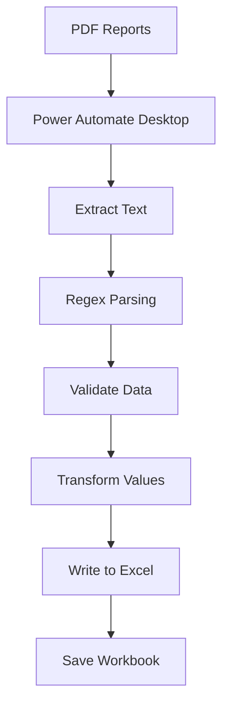

# PDF Report Automation using Power Automate Desktop


## Overview

This project demonstrates an end-to-end Robotic Process Automation (RPA) solution built with **Microsoft Power Automate Desktop**.

The automation processes batches of PDF reports, extracts structured information using text parsing and Regular Expressions (Regex), validates the extracted values, and automatically populates an Excel spreadsheet.

The solution replaces repetitive manual data entry with a fully automated workflow, significantly improving processing speed, accuracy, and consistency.

---

## Business Problem

Previously, each report had to be processed manually by:

- Opening the PDF report
- Searching for required values
- Copying data
- Entering values into Excel
- Verifying the information
- Saving the spreadsheet

Average processing time:

**~6 minutes per report**

This repetitive process was time-consuming and susceptible to human error.

---

## Solution

The Power Automate Desktop workflow automates the complete process:

```
PDF Reports
      │
      ▼
Read PDF Text
      │
      ▼
Extract Required Fields
      │
      ▼
Validate Data
      │
      ▼
Transform Values
      │
      ▼
Update Excel
      │
      ▼
Save Workbook
```

The workflow contains more than **130 Power Automate Desktop actions** and performs the entire process without manual intervention.

Average processing time:

**~25 seconds per report**

---

## Features

- Batch PDF processing
- Automatic PDF text extraction
- Regex-based data extraction
- Data validation
- Excel automation
- Automatic row detection
- Structured data output
- End-to-end unattended execution

---

## Performance Improvement

| Metric | Before | After |
|----------|---------|--------|
| Processing Time | 6 Minutes | 25 Seconds |
| Manual Data Entry | Required | Automated |
| Accuracy | User Dependent | Improved |
| Consistency | Manual | Standardized |

### Results

- 🚀 Reduced processing time by approximately **87.5%**
- 📄 Eliminated repetitive manual data entry
- ⚡ Increased report processing throughput
- ✅ Improved consistency and accuracy
- 🤖 Automated the complete business workflow

---

## Technologies Used

- Microsoft Power Automate Desktop
- Microsoft Excel
- PDF Data Extraction
- Regular Expressions (Regex)
- Microsoft 365
- Robotic Process Automation (RPA)

---

## Technical Highlights

The automation includes:

- PDF document processing
- Batch file iteration
- Regular Expression parsing
- Data transformation
- Excel integration
- Automatic record insertion
- Validation logic
- Workflow automation

---

## Workflow Architecture



---

## Screenshots

### Complete Flow

```
screenshots/flow-overview.png
```

---

## Future Improvements

- Dynamic configuration for Regex patterns
- Enhanced exception handling
- Automatic logging
- Summary report generation
- Support for multiple PDF templates

---

## Skills Demonstrated

- Robotic Process Automation (RPA)
- Microsoft Power Automate Desktop
- Business Process Automation
- Microsoft Excel Automation
- Document Processing
- Regular Expressions (Regex)
- Data Validation
- Workflow Optimization

---

## Disclaimer

This repository showcases the automation architecture and implementation approach.

To protect confidential business information, all company-specific documents, report templates, file paths, and proprietary data have been removed or replaced with sample content.

---

## Author

**Blagoja Pavleski**

Computer Science & Engineering

- Microsoft Power Automate Desktop
- Process Automation
- Microsoft 365
- Excel Automation
